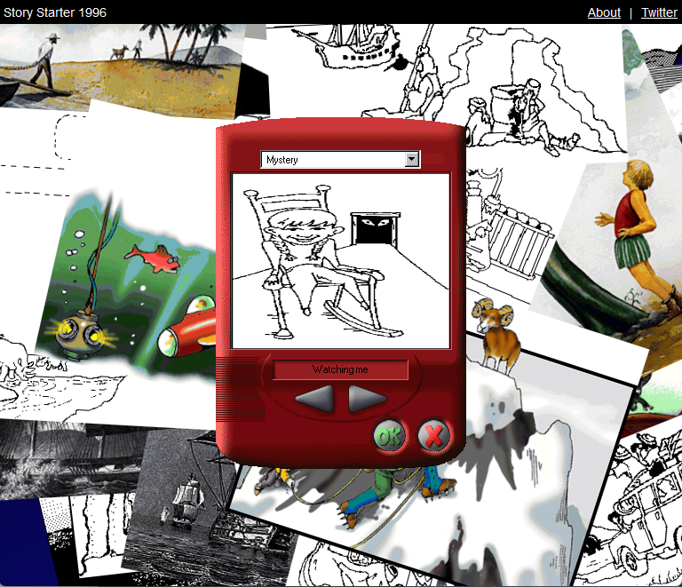

# Story Starter 1996

Microsoft Creative Writer 2's uncanny story starters, now in your browser!



This project was bootstrapped with [Create React App](https://github.com/facebook/create-react-app).

## Available Scripts

- `npm start`
- `npm test`
- `npm run build`


## Adding a New Scene Collection

1. Create a new folder in `./sceneResources`
2. Add an mp3 and a png to the folder. Name the files after the caption they should have. Replace all special characters with `_`. Give them the same name except for the extension.
   - E.g. for a scene called "My new scene!" there should be two files: `My new scene_.mp3` and `My new scene_.png`
3. Add a new json file to `./sceneCollectionManifests`.

```json
{
  "name": "My scene collection", // appears in the dropdown
  "directory": "mySceneCollection", // name of subfolder in sceneResources
  "scenes": [
    "My new scene!" // scene names. Correspond to the mp3/png files in the folder
  ]
}
```

4. Import the new collection in `sceneCollections.js`. In the same file add the imported object to the `scenes` array.

5. Open in a browser and inspect the browser console. If an image or sound in your manifest couldn't be found, you'll know right away.
